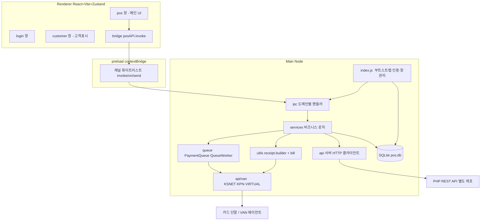
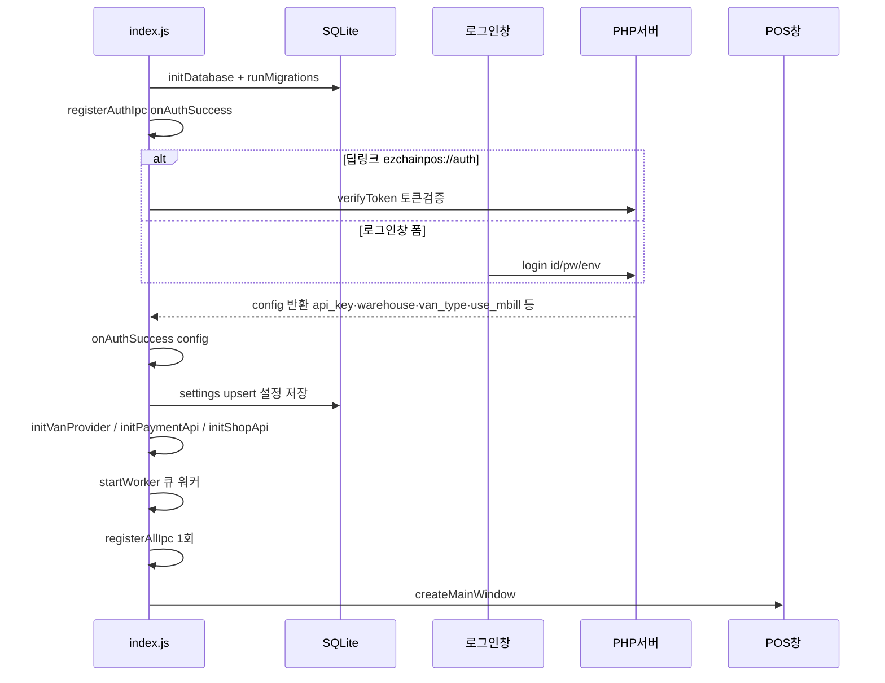
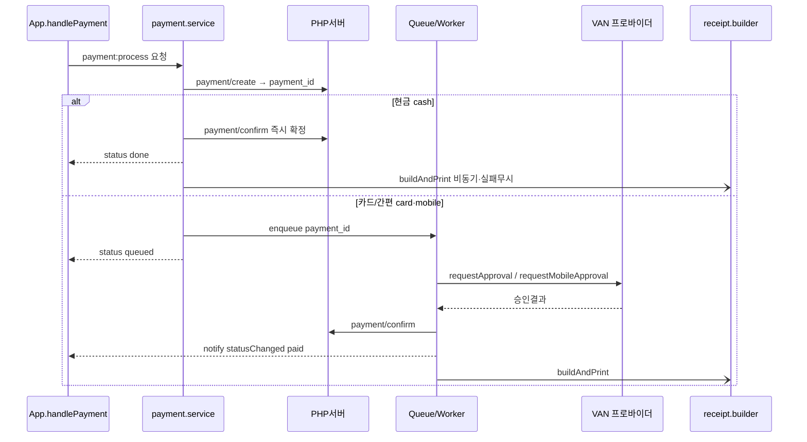
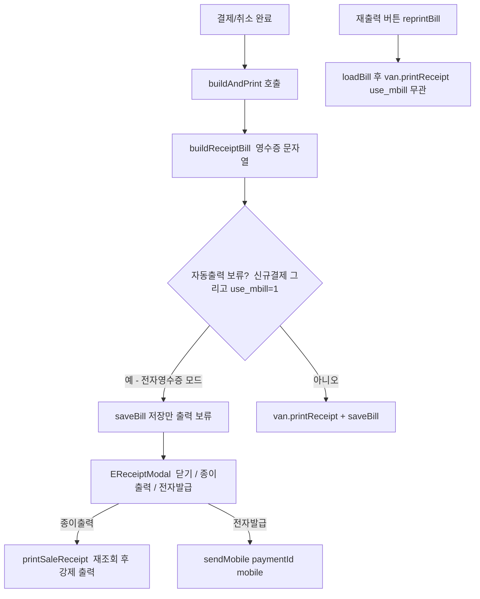

# 아키텍처 설계 (ARCHITECTURE)

Ezchain POS v2 **클라이언트**의 구조와 데이터 흐름을 정리한다. (서버는 별도 레포 — `docs/PRINCIPLES.md` §0)

---

## 1. 큰 그림

Electron 데스크톱 앱. 3개 프로세스 영역으로 나뉜다.



**핵심 원칙**: 렌더러는 절대 직접 네트워크/DB/단말에 접근하지 않는다. 모든 것은 `preload` 화이트리스트를 통과한 IPC → main의 서비스 계층을 거친다.

---

## 2. 레이어별 책임

| 레이어 | 위치 | 책임 |
|---|---|---|
| Renderer UI | `renderer/src/{login,pos,customer}` | 화면·입력. 상태는 Zustand(`posStore`/`cartStore`). |
| Bridge | `renderer/bridge/*.bridge.js` | `window.posAPI.invoke('{도메인}:{동작}')` 래퍼. |
| Preload | `preload/preload.js` | `contextBridge`로 `posAPI` 노출 + **채널 화이트리스트**(보안 경계). |
| IPC 핸들러 | `main/ipc/*.ipc.js` | 채널 → 서비스 함수 매핑. `ipc/index.js`가 일괄 등록. |
| Service | `main/services/*` | 비즈니스 로직(결제/상품/택스리펀드). API·큐·DB·영수증 조율. |
| API 클라이언트 | `main/api/*` | PHP 서버 HTTP 호출(`client.js` + 도메인별 모듈), 응답 정규화. |
| VAN | `main/api/van/*` | 카드 단말 추상화(프로바이더 인터페이스). |
| Queue | `main/queue/*` | 결제 VAN 처리 비동기 큐 + 재시도/데드레터. |
| DB | `main/db/*` | better-sqlite3, 마이그레이션, 리포지토리. |
| 영수증 | `main/utils/receipt.builder.js`, `bill.js` | 영수증 문자열 조립 + VAN 출력/저장. |
| 인프라 | `main/{window,tray,updater}.js`, `api/config.js` | 창/트레이/자동업데이트/환경. |

---

## 3. 부팅 & 인증 흐름



- **환경(dev/prod)**: `api/config.js`가 결정. 기본 prod, dev 허용 시에만 로그인창에서 선택.
- **데모 모드**(`main/demo/`): 외부 API/VAN을 목업으로 대체. `registerAllIpc()`가 데모면 `demo/ipc.js`만 등록.
- `settings` 키-값 테이블이 로그인 config의 로컬 캐시 역할(매장명/사업자번호/van_type/icb_no/cube_no/is_online_enabled/use_mbill/min_usable_point 등).

---

## 4. 결제 흐름 (핵심)

결제는 **수단에 따라 두 경로**로 나뉜다.



- **큐를 쓰는 이유**: 카드 승인은 단말 통신(느림·실패 가능)이라, `payment_queue`에 넣고 `QueueWorker`가 처리하며 **재시도(RetryPolicy)·데드레터**로 안정화한다. 서버 confirm이 실패해도 재시도가 보장된다.
- **렌더러 통지 이벤트**: `payment:progress`(진행 토스트), `payment:statusChanged`(paid/cancelled/failed), `queue:updated`.
- **취소**: 현금은 즉시, 카드는 큐(`type:'cancel'`)로 VAN 취소 → 서버 confirm.
- **분할결제**: 최초건 `payment_id`가 `orgPaymentId`, 후속건은 `org_payment_id` 파라미터로 연결(상품 미저장·suffix id).
- **교환**: 단일 신규 결제 1건(음수+양수 라인, `total_pay=차액`). 원거래 연결은 `exchange_org_id`.

---

## 5. 영수증 출력 파이프라인



- `buildAndPrint`는 결제완료·취소 공용. `use_mbill=1`이면 **자동 출력을 보류하고 저장만** 한다(전자영수증 모드).
- **재출력**은 `buildAndPrint`를 거치지 않고 저장본을 직접 출력하므로 `use_mbill`과 무관하게 항상 실물 출력.
- **VIRTUAL**은 `printReceipt`가 no-op → 물리 출력이 없다.
- 영수증 종류: 일반(`buildReceiptBill`), 현금영수증(`buildCashBillReceiptBill`), 택스리펀드(`buildTaxRefundBill`). 저수준 포매팅은 `utils/bill.js`의 `BillBuilder`.

---

## 6. VAN 추상화

```
main/api/van/
  index.js        getVanProvider() / initVanProvider(type, opts)
  ksnet.van.js    실단말 (KSNET)
  kpn.van.js      실단말 (KPN)
  virtual.van.js  가상포스 — 모든 통신/출력 no-op, 가짜 승인 반환
```

공통 인터페이스: `requestApproval`, `requestCancel`, `requestMobileApproval`, `requestMobileCancel`, `requestCashBillApproval`, `requestCashBillCancel`, `printReceipt`, `checkConnection`.
→ 서비스/큐/영수증은 프로바이더 종류를 몰라도 되고, `van_type`(로그인 config)으로 주입된다.

---

## 7. 로컬 DB

```
main/db/
  database.js        initDatabase + runMigrations (_migrations로 1회 적용 추적)
  migrations/*.sql   NNN_*.sql 순차 적용 (추가만, 수정 금지)
  repositories/      queue.repo 등
```

- 주요 테이블: `settings`(키-값 설정), `payment_queue`(결제 큐), `_migrations`(적용 이력).
- 스키마 변경은 새 마이그레이션 파일 추가로만(§PRINCIPLES 6).

---

## 8. 창(Window) 구성

- **login 창**: 인증. 성공 시 닫히고 POS 창 오픈.
- **pos 창**: 메인. 대부분의 IPC/모달.
- **customer 창**: 고객표시(장바구니 실시간 동기화 — `customer:sync`). 외부 API 불필요라 데모 모드에서도 실핸들러 사용.
- 창 생성: `main/window.js`. 닫기 동작(트레이 최소화/종료)은 `settings.close_behavior` + 트레이(`main/tray.js`).

---

## 9. 자동 업데이트

- `main/updater.js`: 시작 시 서버 `version.json`과 자기 버전 비교, **서버 버전이 더 높을 때만** 업데이트(`compareVersions`).
- 인스톨러 저장소는 서버로 단일화(모든 클라가 서버에서 내려받음). 상세는 `README.md`.

---

## 10. 데이터 흐름 한 줄 요약

```
[렌더러 UI] → posStore/cartStore → bridge.invoke("도메인:동작")
  → preload 화이트리스트 → ipc/*.ipc.js → services/*
    → api/* (PHP 서버) · queue/* (VAN 단말) · db (SQLite) · receipt.builder (출력)
  → notify(payment:statusChanged 등) → 렌더러 상태 갱신
```
