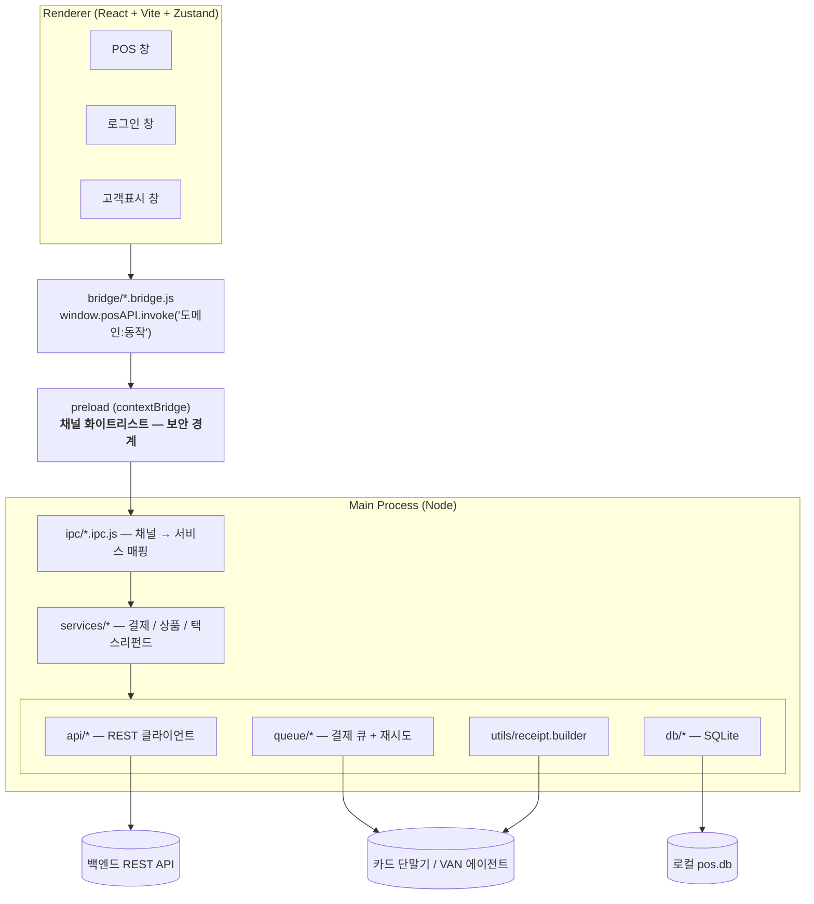
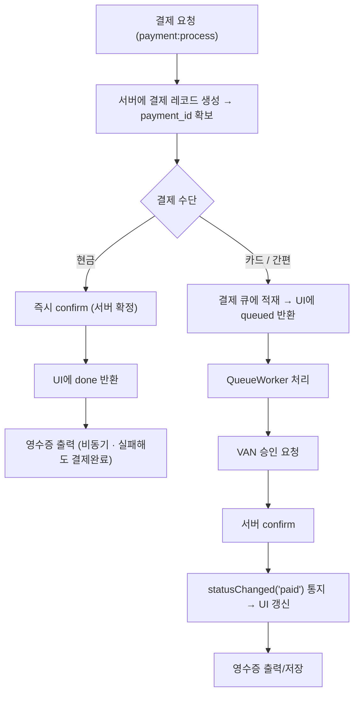
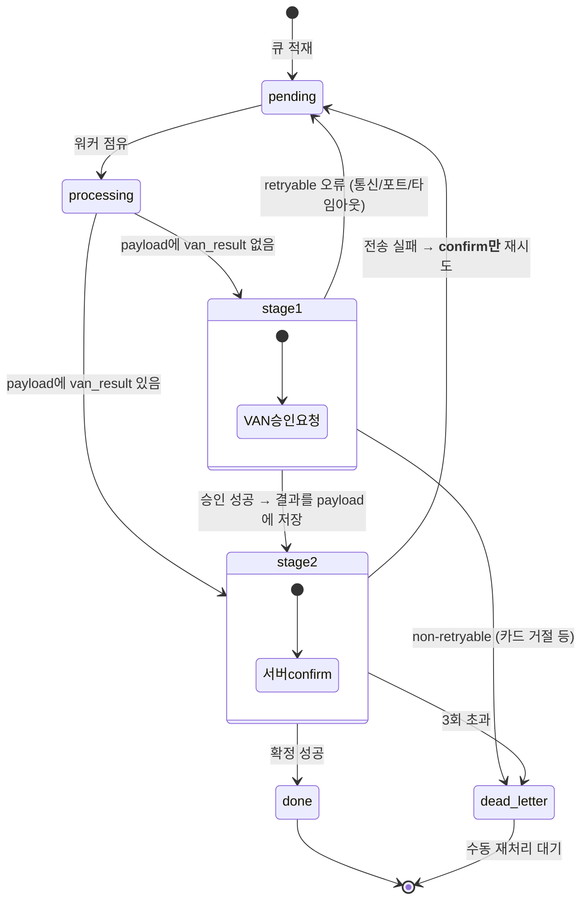
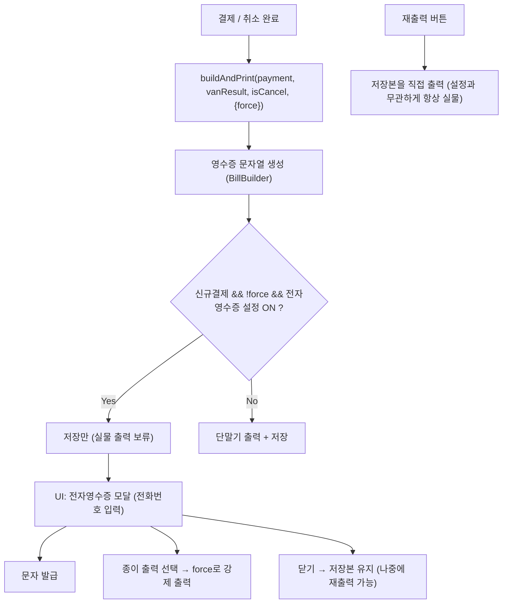
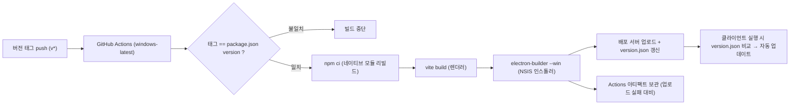

# 설계 노트 — 리테일 POS 데스크톱 v2

> Windows 매장 POS 클라이언트(Electron)의 **구조와 설계 판단**을 기록한 문서입니다.
> 프로젝트 요약·기술 스택·규모는 [README](README2.md)에 있습니다.

**목차**

| | |
|---|---|
| [1. 문서 범위와 공개 처리](#1-문서-범위와-공개-처리) | 무엇을 왜 비공개로 두었는지 |
| [2. 왜 이 프로젝트가 까다로운가](#2-왜-이-프로젝트가-까다로운가) | POS 도메인의 제약 |
| [3. 아키텍처](#3-아키텍처) | 계층 구조 · 보안 경계 |
| [4. 결제 파이프라인](#4-결제-파이프라인) | **2단계 큐 · 재시도 · 파생 케이스** |
| [5. VAN 추상화](#5-van-추상화) | 카드 단말기 4종을 인터페이스 하나로 |
| [6. 영수증 파이프라인](#6-영수증-파이프라인) | 전자영수증 도입과 재출력 보장 |
| [7. 로컬 DB와 설정 캐시](#7-로컬-db와-설정-캐시) | append-only 마이그레이션 |
| [8. 운영 안전장치](#8-운영-안전장치) | 사고를 구조로 막은 9가지 |
| [9. 빌드와 배포 자동화](#9-빌드와-배포-자동화) | 태그 기반 CI · 자동 업데이트 |
| [10. 운영 중 개선 사례](#10-운영-중-개선-사례) | 현장 피드백 3건 |
| [11. 협업과 문서화 규율](#11-협업과-문서화-규율) | 판단 근거를 남기는 방법 |
| [12. 회고](#12-회고) | 잘한 판단과 아쉬운 점 |

<br>

## 1. 문서 범위와 공개 처리

이 문서는 **클라이언트(데스크톱 앱)** 만 다룹니다. 백엔드(PHP REST API + MySQL)는 별도 저장소로 관리되며 범위 밖입니다.

실제 운영 중인 상용 서비스 코드이므로, **회사 자산에 해당하는 정보는 모두 제거**하고 구조·설계 판단·문제 해결 과정만 남겼습니다.

| 항목 | 이 문서에서의 처리 |
|---|---|
| 사명 / 제품명 / 브랜드 | 전부 제거 (`리테일 POS v2`로 일반화) |
| 서버 도메인 · API 엔드포인트 전체 경로 | `<api-host>` 로 치환 |
| Git 저장소 주소 · 조직명 | 제거 |
| VAN(카드단말) 사명 · 전문(패킷) 규격 · 응답코드표 | `VAN-A/B/C` 로 익명화, 전문 레이아웃 전면 제외 |
| VAN 로컬 에이전트 포트 · 설치 경로 · dev 표식 경로 | `<port>`, `C:\<app>\...` 로 치환 |
| 택스리펀드 사업자 SDK 명칭 · 프로토콜 | "택스리펀드 사업자 SDK(WebSocket)" 로 일반화 |
| 인증 딥링크 스킴 · 업로드 키 · 배포 서버 | 제거 (`<scheme>://`) |
| 실제 매장/회원/거래 데이터 | 전혀 포함하지 않음 |

> 코드 조각은 원본 발췌가 아니라 **같은 구조를 재작성한 예시**입니다.

<br>

## 2. 왜 이 프로젝트가 까다로운가

일반 웹 서비스와 달리 POS는 **되돌릴 수 없는 부작용(side effect)** 을 다룹니다.

- 카드 승인은 **외부 단말기와의 물리 통신**입니다. 느리고(수십 초), 사람이 카드를 꽂는 동안 멈춰 있고, 실패 원인이 다양합니다(포트 점유, VAN 서버 오류, 카드 거절).
- 승인은 됐는데 **서버 확정(confirm) 요청이 실패**하면, 고객 카드에서는 돈이 빠져나갔지만 매출 기록이 없습니다. 반대로 재시도를 잘못하면 **같은 카드에 두 번 승인**됩니다.
- 계산대는 멈출 수 없습니다. 영수증 프린터가 고장 났다고 결제가 취소되면 안 됩니다.

그래서 설계의 중심에 둔 원칙은 세 가지였습니다.

1. **돈이 움직이는 작업은 큐에 넣고, 단계별로 재시도한다.** — 재시도해도 이중 승인이 나지 않도록 단계를 쪼갠다.
2. **결제 확정과 부수 작업을 분리한다.** — 영수증 출력·로그 전송 실패는 결제를 막지 않는다.
3. **렌더러(UI)는 아무 권한도 갖지 않는다.** — 네트워크·DB·단말기 접근은 전부 메인 프로세스에서만.

<br>

## 3. 아키텍처

### 3.1 계층 구조



| 계층 | 책임 |
|---|---|
| **Renderer UI** | 화면·입력만. 상태는 Zustand 스토어 2개(`posStore` / `cartStore`)로 단일화 |
| **Bridge** | `{도메인}Bridge.{동작}` 형태의 얇은 래퍼. 채널명 문자열을 UI 코드에서 격리 |
| **Preload** | `contextBridge`로 `posAPI`만 노출 + **invoke/on/send 채널 화이트리스트**(보안 경계) |
| **IPC 핸들러** | `{도메인}:{동작}` 채널 → 서비스 함수 매핑. 도메인별 파일, 인덱스에서 일괄 등록 |
| **Service** | 비즈니스 로직. API·큐·DB·영수증 출력을 조율 |
| **API 클라이언트** | REST 호출 + 응답 정규화. 타임아웃/세션만료 공통 처리 |
| **VAN** | 카드 단말기 추상화. 프로바이더 인터페이스 하나로 4종 구현체 교체 |
| **Queue** | 결제/취소 비동기 처리 + 지수 백오프 재시도 + 데드레터 |
| **DB** | better-sqlite3, append-only 마이그레이션, 리포지토리 |

### 3.2 보안 경계 — preload 화이트리스트

렌더러에 `ipcRenderer`를 직접 노출하지 않고, **허용된 채널 목록을 통과한 호출만** 메인으로 넘깁니다.
현재 `invoke` 50 / `on` 5 / `send` 2, 총 57개 채널이 등록되어 있습니다.

```js
// preload/preload.js (구조 예시)
const ALLOWED = {
  invoke: ['payment:process', 'payment:cancel', 'product:search', /* ... */],
  on:     ['payment:statusChanged', 'payment:progress', 'queue:updated', /* ... */],
  send:   ['customer:sync', /* ... */],
};

contextBridge.exposeInMainWorld('posAPI', {
  version,
  invoke(channel, ...args) {
    if (!ALLOWED.invoke.includes(channel)) {
      throw new Error(`허용되지 않은 IPC 채널: ${channel}`);
    }
    return ipcRenderer.invoke(channel, ...args);
  },
  // on / send 동일 패턴
});
```

> 새 핸들러를 추가하면 화이트리스트 등록이 **강제**됩니다(누락 시 렌더러에서 즉시 에러). 팀 규칙으로만 두지 않고 런타임에서 막히도록 만든 이유는, POS는 매장 PC에서 돌기 때문에 렌더러 측 코드가 임의로 서버·단말기에 접근할 수 있는 통로를 남기고 싶지 않았기 때문입니다.

<br>

## 4. 결제 파이프라인

### 4.1 수단에 따라 두 갈래



카드 승인은 단말기 조작 시간(최대 60초)을 기다려야 해서 UI를 붙잡아둘 수 없습니다.
그래서 **UI에는 `queued`를 즉시 돌려주고**, 진행 상황은 `payment:progress` 토스트로,
최종 결과는 `payment:statusChanged` 이벤트로 밀어주는 구조를 택했습니다.

### 4.2 이중 승인을 막는 2단계 큐

가장 중요한 설계 판단입니다. **재시도 단위를 "결제 전체"가 아니라 "단계"로** 잡았습니다.



핵심은 **Stage 1이 성공하면 VAN 승인 결과를 큐 레코드의 payload에 먼저 기록**한다는 점입니다.
이후 서버 전송이 실패해 재시도되더라도 워커는 payload에 승인 결과가 있음을 보고
**Stage 2(전송)만 다시 시도**합니다. 즉 재시도가 카드에 두 번 닿지 않습니다.

```js
// queue/QueueWorker.js (구조 예시)
const payload = JSON.parse(item.payload);

if (payload.type === 'cancel') {
  payload.van_cancel_result ? await runCancelConfirm(item, payload)   // Stage 2
                            : await runVanCancel(item, payload);      // Stage 1
} else {
  payload.van_result ? await runConfirm(item, payload)                // Stage 2
                     : await runVanApproval(item, payload);           // Stage 1
}
```

취소 플로우도 완전히 같은 2단계 구조(`van_cancel_result`)로 맞췄습니다.

### 4.3 재시도 정책과 오류 분류

```js
// queue/RetryPolicy.js — 지수 백오프
const MAX_ATTEMPTS = 3;
const BASE_DELAY_MS = 2000;        // 실패 1회 → 2s, 2회 → 4s, 3회 → 8s → dead_letter
const shouldRetry = n => n < MAX_ATTEMPTS;
const nextRetryAt = n => toSqliteLocal(Date.now() + BASE_DELAY_MS * 2 ** n);
```

재시도 여부는 **오류 자체가 스스로 알려주도록** `VanError({ retryable })`로 감쌌습니다.

| 분류 | 예 | 처리 |
|---|---|---|
| retryable | 포트 열기 실패, 이전 거래 미완료, 통신 타임아웃, VAN 서버 오류 | 백오프 후 재시도 |
| non-retryable | 카드 거절, 한도 초과, 미지원 결제수단 | **즉시 데드레터** (재시도해도 결과가 같음) |

카드 거절을 3회 재시도하면 고객은 단말기 앞에서 30초를 더 기다립니다. "재시도 가치가 있는 실패"만 재시도하는 것이 UX·정확성 양쪽에 필요했습니다.

### 4.4 큐 테이블

```sql
CREATE TABLE payment_queue (
  id            INTEGER PRIMARY KEY AUTOINCREMENT,
  status        TEXT NOT NULL DEFAULT 'pending',   -- pending|processing|done|failed|dead_letter
  attempt_count INTEGER NOT NULL DEFAULT 0,
  max_attempts  INTEGER NOT NULL DEFAULT 3,
  next_retry_at TEXT,
  payload       TEXT NOT NULL,                     -- JSON (단계 결과 누적)
  error_log     TEXT,
  created_at    TEXT NOT NULL DEFAULT (datetime('now','localtime')),
  updated_at    TEXT NOT NULL DEFAULT (datetime('now','localtime'))
);
CREATE INDEX idx_payment_queue_status ON payment_queue(status, next_retry_at);
```

워커는 3초 폴링 + 결제 발생 시 즉시 트리거(`triggerNow()`)로 동작하고, `isProcessing` 플래그로 **단일 처리(직렬화)** 를 보장합니다. 단말기는 동시에 두 거래를 받을 수 없기 때문입니다.

### 4.5 파생 케이스

| 케이스 | 처리 방식 |
|---|---|
| **분할결제** | 첫 건의 `payment_id`를 원거래로 삼고, 후속 건은 원거래 ID를 파라미터로 연결 |
| **부분/전체 취소** | 현금은 즉시, 카드는 큐(`type:'cancel'`)로 VAN 취소 → 서버 확정. 간편결제 취소는 원거래 바코드를 서버에서 역조회해 전문에 채움 |
| **교환** | 반품 라인(음수) + 신규 라인(양수)을 **한 건의 결제**로 만들고 결제액은 차액. 원거래는 `exchange_org_id`로 연결 |
| **택스리펀드** | 사업자 SDK 통신은 렌더러에서, 결과 저장·영수증 출력은 메인에서. 결제 레코드를 **미리 생성**해 환급 전표와 결제를 같은 ID로 묶음 |

<br>

## 5. VAN 추상화

VAN사마다 통신 방식이 전혀 다릅니다(로컬 HTTP + JSONP 응답, 고정 길이 전문, 바이너리 헤더 + 구분자 본문, 인코딩도 상이). 이걸 서비스 계층에 노출하면 결제 로직이 VAN사별로 갈라집니다.

그래서 **8개 메서드 인터페이스 하나로 봉인**했습니다.

```
requestApproval        requestCancel
requestMobileApproval  requestMobileCancel      ← 간편결제(QR)
requestCashBillApproval requestCashBillCancel   ← 현금영수증
printReceipt           checkConnection
```

```js
// api/van/index.js (구조 예시)
const VAN_MAP = {
  'van-a':   () => require('./van-a.van'),    // CAT 단말 · 로컬 HTTP + 고정길이 전문
  'van-b':   () => require('./van-b.van'),    // CAT 단말 · 별도 프로토콜
  'van-c':   () => require('./van-c.van'),    // 로컬 데몬 HTTP
  'virtual': () => require('./virtual.van'),  // 가상 단말 — 통신·출력 모두 no-op
};

function initVanProvider(vanType, options) { /* 로그인 config의 van_type으로 주입 */ }
function getVanProvider() { /* 싱글톤 반환 */ }
```

얻은 것:

- 서비스·큐·영수증 코드는 **어느 VAN사인지 모릅니다.** 매장 설정값 하나로 결정됩니다.
- **가상 단말(VIRTUAL)** 프로바이더가 무인/온라인 매장 요구사항을 그대로 흡수했습니다. "영수증을 출력하지 않는다", "단말기가 없다" 같은 요구가 별도 분기 없이 `printReceipt`를 no-op으로 두는 것만으로 충족됩니다.
- 신규 VAN사 추가는 파일 1개 + 맵 1줄. 다만 **세 프로바이더 모두에 같은 메서드가 존재해야 한다**는 규칙을 문서화했습니다(한 곳만 추가하면 특정 매장에서만 터짐).
- VAN 요청/응답 전문은 서버에 로깅해 장애를 추적하되, **카드번호는 앞 6 + `******` + 뒤 4로 마스킹**하고 로깅 자체는 fire-and-forget으로 두어 결제 흐름을 막지 않게 했습니다.

<br>

## 6. 영수증 파이프라인

종이 영수증을 자동 출력하던 구조에, **전자영수증(문자 발급)** 요구가 추가됐습니다.
문제는 재출력·현금영수증·택스리펀드 등 기존 출력 경로를 깨지 않고 끼워 넣는 것이었습니다.



설계 판단 두 가지:

- **출력 함수를 분기시키지 않고 `force` 플래그 하나만 추가**했습니다. 결제·취소·현금영수증·택스리펀드가 모두 같은 진입점을 쓰기 때문에, 분기를 늘리면 조합이 폭발합니다.
- **재출력은 `buildAndPrint`를 거치지 않습니다.** 저장본을 그대로 출력하므로 전자영수증 설정과 무관하게 항상 종이가 나옵니다. "손님이 영수증을 달라고 하는데 안 나온다"가 가장 흔한 현장 컴플레인이라, 이 경로만은 설정에 영향받지 않게 못 박았습니다.

<br>

## 7. 로컬 DB와 설정 캐시

- **append-only 마이그레이션**: `NNN_*.sql` 파일을 순차 적용하고 `_migrations` 테이블로 1회 적용을 추적합니다. **기존 파일은 절대 수정하지 않습니다** — 이미 배포된 매장 PC에는 재실행되지 않기 때문입니다. 현재 10개.
- **`settings` 키-값 테이블**: 로그인 시 서버가 내려주는 매장 config(매장명·사업자번호·VAN 타입·단말기 번호·전자영수증 사용여부·적립금 최소사용액 등)를 로컬에 캐시합니다. 설정 항목 추가가 **스키마 변경 없이 키 1개 추가**로 끝나, 서버 주도로 기능을 켜고 끌 수 있습니다.
- `better-sqlite3`는 네이티브 모듈이라 `postinstall`에서 Electron ABI에 맞춰 `electron-rebuild`하고, CI에서도 동일하게 수행합니다.

<br>

## 8. 운영 안전장치

실제로 매장에 설치되어 돌아가는 앱이라, "사고가 나지 않게 하는 장치"에 별도로 공을 들였습니다.

| 장치 | 내용 | 이유 |
|---|---|---|
| **환경 고정** | 기본값은 **항상 운영 서버**. 개발 서버 선택 UI는 ①소스 실행이거나 ②해당 PC에 dev 표식 파일이 있을 때만 노출 | 매장 설치본이 개발 서버를 바라보는 사고를 구조적으로 차단 |
| **다운그레이드 가드** | 자동 업데이트는 서버 버전이 **현재보다 높을 때만** 실행 (`compareVersions > 0`) | 단순 `!==` 비교였다면 서버 롤백 시 전 매장이 구버전으로 되돌아감 |
| **부수 작업 격리** | 영수증 출력·저장, VAN 전문 로깅, 쿠폰 기록 실패는 **에러를 삼키고 로그만** | 프린터 고장이 결제 확정을 막으면 안 됨 |
| **세션 만료 훅** | HTTP 401 + 특정 코드 감지 시 공통 클라이언트가 재로그인 플로우를 트리거 | 모든 API 모듈에 인증 분기를 흩뿌리지 않기 위해 |
| **타임아웃 분리** | 서버 API 10초(AbortController), 단말기 통신 60초 | 사람이 카드를 꽂는 시간과 서버 응답 시간은 성질이 다름 |
| **상태 표시** | 헬스 엔드포인트 + 단말기 연결 확인을 주기 체크해 헤더에 네트워크/단말 상태 표시 | 장애 시 점원이 "왜 안 되는지"를 즉시 알 수 있어야 함 |
| **일자별 파일 로거** | `userData/logs/pos-YYYY-MM-DD.log`, 개발/운영 로그 레벨 분리 | 원격 지원 시 로그 회수로 원인 추적 |
| **데드레터 재처리** | 3회 초과 실패 건은 데드레터로 남기고 UI에서 수동 재처리 | 자동 재시도를 무한히 하지 않되, 승인 기록을 유실하지도 않음 |
| **데모 모드** | 외부 API·VAN을 목업으로 대체하는 전용 IPC 세트 | 단말기 없는 환경에서 시연·QA·UI 개발 가능 |

<br>

## 9. 빌드와 배포 자동화



- **태그/버전 일치 검증**을 CI 첫 단계에 둬서, 인스톨러 파일명(버전 기반)과 실제 버전이 어긋나는 사고를 막았습니다.
- 업로드 키는 저장소 시크릿으로만 주입합니다(로컬 수동 배포 시에는 gitignore된 설정 파일 → 환경변수 우선순위).
- 인스톨러 배포처를 **서버 한 곳으로 단일화**해, 모든 매장이 같은 파일을 받도록 했습니다.
- 로컬 수동 배포 경로(`build:server`)도 유지 — CI가 막혔을 때의 백업 수단.

<br>

## 10. 운영 중 개선 사례

현장 피드백에서 나온 개선 중, **판단 근거가 남을 만한** 것 세 가지입니다.

### 사례 1 — 바코드 스캔 실패 후 계산대가 멈추는 문제

- **증상**: 등록되지 않은 바코드를 스캔하면 입력값이 남아, 다음 스캔이 기존 문자열 뒤에 이어붙어 계속 조회 실패. 점원이 원인을 몰라 계산이 멈춤.
- **원인**: 초기화 로직이 **성공 경로에만** 있었음.
- **처리**: `try/catch`에 `finally`를 붙여 성공/미조회/예외 **모든 경로에서** 입력값 초기화 + 입력창 포커스 복귀. 빈 입력 경고·조회 차단 경로도 동일 헬퍼를 타게 정리.
- **배운 점**: 하드웨어 스캐너는 사람과 달리 "실패했으니 지워야지"를 판단하지 않습니다. 입력 초기화는 성공의 부수효과가 아니라 **모든 종료 경로의 계약**이어야 했습니다.

### 사례 2 — 수량 직접 입력

- **요구**: 같은 상품 20개를 `+` 버튼으로 20번 눌러야 했음.
- **판단**: 항상 `<input>`을 두는 방식은 배제. 주문 목록 행은 폭이 좁고(버튼 22px) 상시 입력창은 시각적 노이즈 + 오조작으로 수량이 바뀔 위험이 있어, **숫자 클릭 시 입력창으로 전환**하는 방식을 택했습니다.
- **구현 디테일**: 확정은 Enter 또는 포커스아웃, 취소는 Esc. 숫자 필터 + 3자리 제한 + 상한 클램프. 타이핑 중간값이 스토어에 반영되어 금액이 깜빡이는 걸 막기 위해 **편집 중에는 컴포넌트 로컬 draft**만 두고 확정 시점에 한 번 커밋. Enter/Esc 처리 직후 따라오는 blur의 중복 확정은 플래그로 차단.
- `0`으로 확정하면 삭제 — 새 규칙이 아니라 기존 `−` 버튼 동작과 동일하게 맞췄습니다.

### 사례 3 — 전체 취소 후 일부만 재결제 ("상품 다시 담기")

- **요구**: 결제를 전체 취소하고 일부 상품만 다시 결제하는 케이스에서, 상품을 하나씩 재스캔해야 했음.
- **판단**: 전부 담아준 뒤 필요 없는 것을 지우는 흐름이 가장 빠름. 대신 **복원해서는 안 되는 라인**이 있었습니다.
- **핵심 처리**: 추가할인·쿠폰·적립금은 결제 전송 시 **음수 금액 상품 라인**으로 표현되고 조회 응답에도 그대로 내려옵니다. 그대로 복원하면 **이미 사용된 쿠폰·적립금이 재적용**됩니다. 세 라인 모두 정가가 음수이므로 **부호 검사 한 번으로 필터링**했습니다.
- **부가 판단**:
  - 원거래 단가(프로모션가)를 유지 — 정가로 되돌리면 "동일 조건 재결제"가 아니게 됨.
  - 복원 시 조회 드로어를 닫음 — 드로어가 열려 있으면 상품 담기가 차단되고 카트 편집이 불가.
  - 카트에 상품이 남아 있으면 덮어쓰기 확인 모달 — 작업 중이던 카트 소실 방지. 비어 있으면 확인 없이 즉시.

<br>

## 11. 협업과 문서화 규율

2인 협업 + AI 페어 프로그래밍(Claude Code) 환경에서, **판단 근거가 코드 밖으로 사라지지 않게** 문서 3종을 유지했습니다.

| 문서 | 역할 |
|---|---|
| `PRINCIPLES.md` | 개발 대원칙. 결제/큐 파일은 **수정 전 계획 승인 필수**, IPC 추가 시 화이트리스트 등록 강제, 마이그레이션 append-only, 상태는 지정 스토어로만, VAN 포트 하드코딩 금지 등 |
| `ARCHITECTURE.md` | 계층 책임, 부팅/인증 흐름, 결제·영수증 파이프라인 다이어그램. 구조 변경 시 갱신 |
| `CHANGELOG.md` | 의미 있는 수정마다 **수정내용 / 판단근거 / 영향코드 / 비고**를 최신순 누적 |

특히 CHANGELOG에 **"판단근거"** 칸을 강제한 것이 효과가 컸습니다. 결제 로직은 몇 달 뒤에 보면 "왜 여기서 에러를 삼키는가"가 이해되지 않아 되돌리기 쉬운데, 그 되돌림이 곧 장애가 됩니다. 위 10장의 사례 설명도 대부분 이 기록에서 나왔습니다.

<br>

## 12. 회고

**잘한 판단**

- **재시도 단위를 단계로 쪼갠 것.** 이 결정 하나가 이중 승인과 승인 누락을 동시에 막았습니다. 처음부터 "결제 전체 재시도"로 만들었다면 나중에 되돌리기 매우 어려운 구조가 됐을 겁니다.
- **VAN 추상화.** 신규 VAN사와 가상 단말 요구가 각각 파일 1개 추가로 끝났습니다. 인터페이스를 8개 메서드로 좁게 고정한 것이 핵심이었습니다.
- **런타임에서 막히는 규칙.** IPC 화이트리스트처럼, 문서로만 존재하는 규칙 대신 어기면 즉시 에러가 나는 구조를 택한 부분들이 실제로 사고를 줄였습니다.

**아쉬운 점 / 다음에 할 것**

- **렌더러 CSS가 8.1k LOC로 비대**합니다. 초기에 단일 `pos.css`로 시작한 대가로, 모달이 25개까지 늘어난 지금은 컴포넌트 단위 스타일 분리나 토큰화가 필요합니다.
- **자동 테스트가 없습니다.** 결제 상태 전이(2단계 큐, retryable 분류, 교환/분할)는 순수 함수로 떼어낼 수 있는 영역이 많아, 단위 테스트 가치가 가장 큰 부분인데 수동 QA에 의존했습니다. 큐 워커의 상태 전이 테이블 테스트를 최우선으로 넣고 싶습니다.
- **로컬 DB의 초기 스키마(상품/주문 테이블)가 실사용되지 않은 채 남아** 있습니다. 서버 주도 구조로 바뀌면서 역할이 사라졌는데, append-only 원칙 때문에 정리 마이그레이션을 따로 넣어야 했습니다. 초기 설계에서 "로컬 DB의 책임 범위"를 더 좁게 정의했어야 했습니다.

<br>

---

<sub>이 문서는 포트폴리오 제출용으로 작성되었으며, 회사 자산에 해당하는 식별 정보·자격증명·외부 연동 규격은 의도적으로 제외했습니다. 코드 예시는 원본 발췌가 아닌 구조 재작성입니다.</sub>
