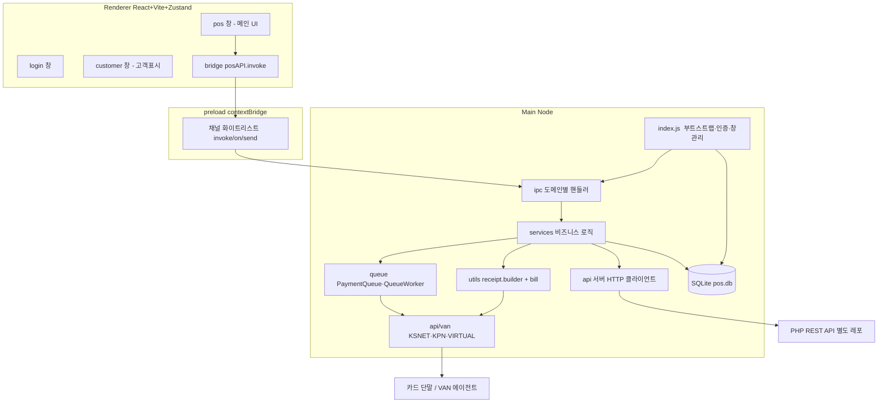
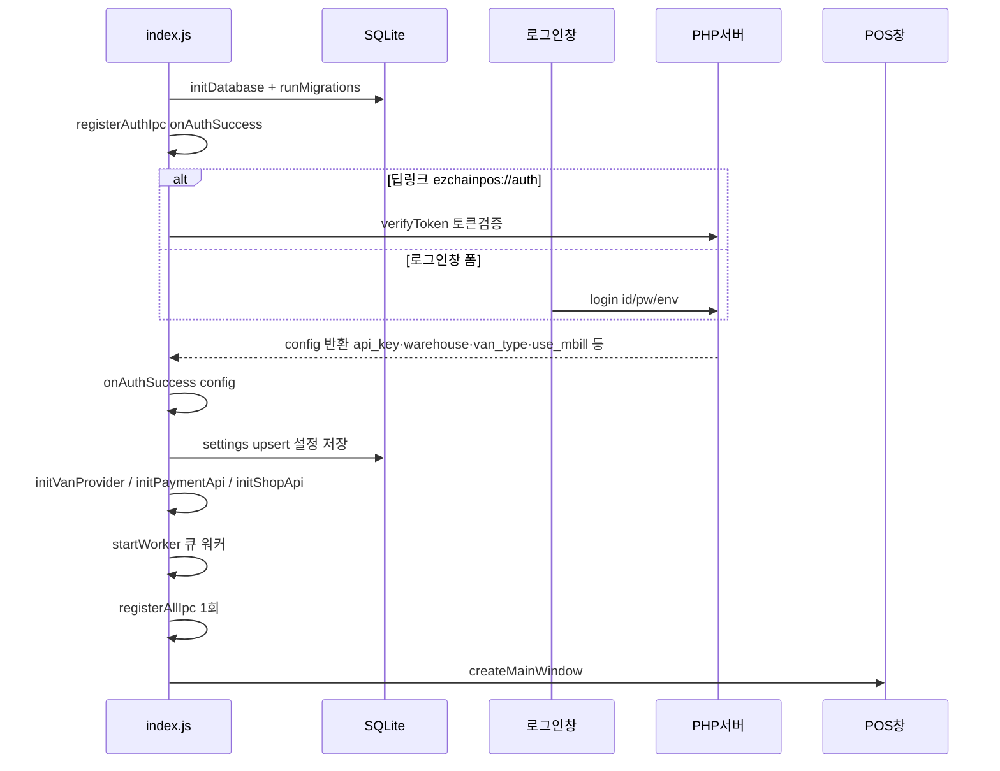
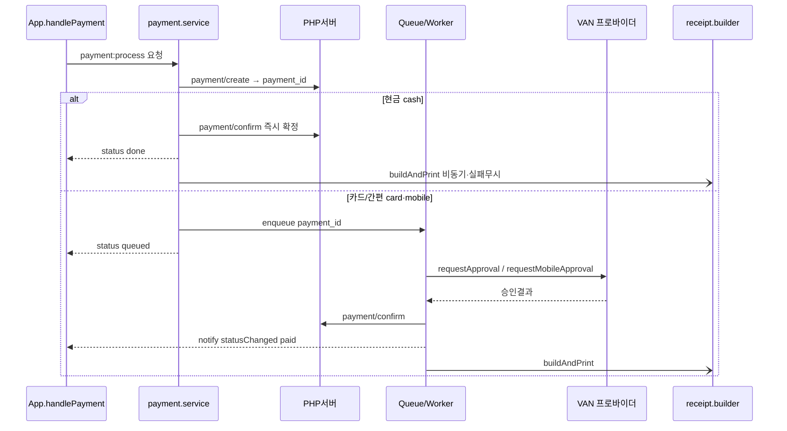
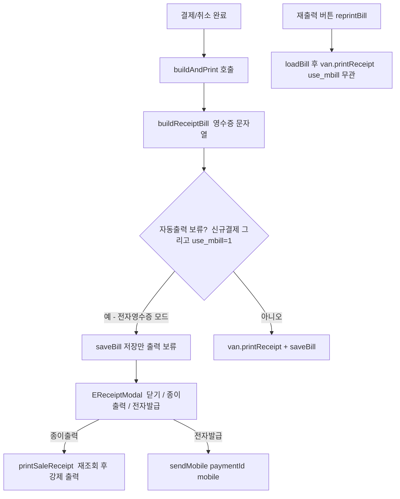

# electron-POS
## 개발 기간

* 2026.04 ~ 2026.05 (2026.06 ~ 현재 테스트 진행 중)

## 프로젝트 인원

* 개발자 1명 (본인) , 디자인팀

## 담당 역할 (기획 · 아키텍처 설계 · 핵심 기능 개발)

* Electron Main/Renderer 이중 프로세스 구조를 설계하고, Context Isolation 및 IPC 채널 화이트리스트 기반의 보안 아키텍처를 구축
* Service → IPC → API의 3계층 구조를 설계하여 기능 확장성과 유지보수성을 향상
* VAN 단말 승인(1단계)과 백엔드 결제 확정(2단계)을 분리한 2단계 결제 큐 시스템을 구현하여, 앱 재시작 시에도 중복 결제 없이 자동 복구 가능하도록 설계
* SQLite WAL 모드 기반 데이터 저장 구조와 마이그레이션 버전 관리 시스템을 구축하여 스키마 무결성 보장
* 지수 백오프(2초 → 4초 → 8초, 최대 3회) 재시도 정책과 Dead Letter Queue(DLQ)를 도입하여 결제 유실 및 장애 상황 대응
* KSCAT VAN 단말 프로토콜을 연동하고, EUC-KR 인코딩 처리, 60바이트 전문 파싱, 재시도 가능·불가 오류 분류 로직 구현
* PHP REST API와 연동하여 인증, 결제 승인/취소, 주문 조회 기능을 구현하고, Deep Link(ezchainpos://) 기반 SSO 로그인 흐름 개발
* 카드·현금 복합 결제, 할부 결제, 면세 거래, 결제 취소 등 다양한 결제 시나리오 구현
* Winston 기반의 로그 시스템을 구축하고, 날짜별 로그 관리 및 IPC 공통 에러 처리·로깅 체계 구현

## 사용 기술

* Electron 29
* React 18
* Vite
* Zustand
* SQLite (better-sqlite3)
* PHP
* REST API
* iconv-lite
* Winston
* electron-builder (NSIS)

## 프로젝트 개요

소매·유통 매장을 위한 데스크톱 POS(Point of Sale) 애플리케이션.

Electron과 React 기반으로 개발되었으며, VAN 단말기 연동, 오프라인 환경에서도 안정적으로 동작하는 결제 큐 시스템, 재고·주문·쿠폰 관리 기능을 제공한다. Windows 환경에서 NSIS 설치 프로그램 형태로 배포된다.

-----
## 아키텍처 설계 (ARCHITECTURE)

Ezchain POS v2 **클라이언트**의 구조와 데이터 흐름을 정리한다. (서버는 별도 레포 — `docs/PRINCIPLES.md` §0)

### 1. 큰 그림

Electron 데스크톱 앱. 3개 프로세스 영역으로 나뉜다.



**핵심 원칙**: 렌더러는 절대 직접 네트워크/DB/단말에 접근하지 않는다. 모든 것은 `preload` 화이트리스트를 통과한 IPC → main의 서비스 계층을 거친다.


### 2. 레이어별 책임

| 레이어 | 위치 | 책임 |
|---|---|---|
| Renderer UI | `renderer/src/{login,pos,customer}` | 화면·입력. 상태는 Zustand(`posStore`/`cartStore`). |
| Bridge | `renderer/bridge/*.bridge.js` | `window.posAPI.invoke('{도메인}:{동작}')` 래퍼. |
| Preload | `preload/preload.js` | `contextBridge`로 `posAPI` 노출 + **채널 화이트리스트**(보안 경계). |
| IPC 핸들러 | `main/ipc/*.ipc.js` | 채널 → 서비스 함수 매핑. `ipc/index.js`가 일괄 등록. |
| Service | `main/services/*` | 비즈니스 로직(결제/상품/택스리펀드). API·큐·DB·영수증 조율. |
| API 클라이언트 | `main/api/*` | PHP 서버 HTTP 호출(`client.js` + 도메인별 모듈), 응답 정규화. |
| VAN | `main/api/van/*` | 카드 단말 추상화(프로바이더 인터페이스). |
| Queue | `main/queue/*` | 결제 VAN 처리 비동기 큐 + 재시도/데드레터. |
| DB | `main/db/*` | better-sqlite3, 마이그레이션, 리포지토리. |
| 영수증 | `main/utils/receipt.builder.js`, `bill.js` | 영수증 문자열 조립 + VAN 출력/저장. |
| 인프라 | `main/{window,tray,updater}.js`, `api/config.js` | 창/트레이/자동업데이트/환경. |


### 3. 부팅 & 인증 흐름



- **환경(dev/prod)**: `api/config.js`가 결정. 기본 prod, dev 허용 시에만 로그인창에서 선택.
- **데모 모드**(`main/demo/`): 외부 API/VAN을 목업으로 대체. `registerAllIpc()`가 데모면 `demo/ipc.js`만 등록.
- `settings` 키-값 테이블이 로그인 config의 로컬 캐시 역할(매장명/사업자번호/van_type/icb_no/cube_no/is_online_enabled/use_mbill/min_usable_point 등).


### 4. 결제 흐름 (핵심)

결제는 **수단에 따라 두 경로**로 나뉜다.



- **큐를 쓰는 이유**: 카드 승인은 단말 통신(느림·실패 가능)이라, `payment_queue`에 넣고 `QueueWorker`가 처리하며 **재시도(RetryPolicy)·데드레터**로 안정화한다. 서버 confirm이 실패해도 재시도가 보장된다.
- **렌더러 통지 이벤트**: `payment:progress`(진행 토스트), `payment:statusChanged`(paid/cancelled/failed), `queue:updated`.
- **취소**: 현금은 즉시, 카드는 큐(`type:'cancel'`)로 VAN 취소 → 서버 confirm.
- **분할결제**: 최초건 `payment_id`가 `orgPaymentId`, 후속건은 `org_payment_id` 파라미터로 연결(상품 미저장·suffix id).
- **교환**: 단일 신규 결제 1건(음수+양수 라인, `total_pay=차액`). 원거래 연결은 `exchange_org_id`.


### 5. 영수증 출력 파이프라인



- `buildAndPrint`는 결제완료·취소 공용. `use_mbill=1`이면 **자동 출력을 보류하고 저장만** 한다(전자영수증 모드).
- **재출력**은 `buildAndPrint`를 거치지 않고 저장본을 직접 출력하므로 `use_mbill`과 무관하게 항상 실물 출력.
- **VIRTUAL**은 `printReceipt`가 no-op → 물리 출력이 없다.
- 영수증 종류: 일반(`buildReceiptBill`), 현금영수증(`buildCashBillReceiptBill`), 택스리펀드(`buildTaxRefundBill`). 저수준 포매팅은 `utils/bill.js`의 `BillBuilder`.


### 6. VAN 추상화

```
main/api/van/
  index.js        getVanProvider() / initVanProvider(type, opts)
  ksnet.van.js    실단말 (KSNET)
  kpn.van.js      실단말 (KPN)
  virtual.van.js  가상포스 — 모든 통신/출력 no-op, 가짜 승인 반환
```

공통 인터페이스: `requestApproval`, `requestCancel`, `requestMobileApproval`, `requestMobileCancel`, `requestCashBillApproval`, `requestCashBillCancel`, `printReceipt`, `checkConnection`.
→ 서비스/큐/영수증은 프로바이더 종류를 몰라도 되고, `van_type`(로그인 config)으로 주입된다.


### 7. 로컬 DB

```
main/db/
  database.js        initDatabase + runMigrations (_migrations로 1회 적용 추적)
  migrations/*.sql   NNN_*.sql 순차 적용 (추가만, 수정 금지)
  repositories/      queue.repo 등
```

- 주요 테이블: `settings`(키-값 설정), `payment_queue`(결제 큐), `_migrations`(적용 이력).
- 스키마 변경은 새 마이그레이션 파일 추가로만(§PRINCIPLES 6).


### 8. 창(Window) 구성

- **login 창**: 인증. 성공 시 닫히고 POS 창 오픈.
- **pos 창**: 메인. 대부분의 IPC/모달.
- **customer 창**: 고객표시(장바구니 실시간 동기화 — `customer:sync`). 외부 API 불필요라 데모 모드에서도 실핸들러 사용.
- 창 생성: `main/window.js`. 닫기 동작(트레이 최소화/종료)은 `settings.close_behavior` + 트레이(`main/tray.js`).


### 9. 자동 업데이트

- `main/updater.js`: 시작 시 서버 `version.json`과 자기 버전 비교, **서버 버전이 더 높을 때만** 업데이트(`compareVersions`).
- 인스톨러 저장소는 서버로 단일화(모든 클라가 서버에서 내려받음). 상세는 `README.md`.


### 10. 데이터 흐름 한 줄 요약

```
[렌더러 UI] → posStore/cartStore → bridge.invoke("도메인:동작")
  → preload 화이트리스트 → ipc/*.ipc.js → services/*
    → api/* (PHP 서버) · queue/* (VAN 단말) · db (SQLite) · receipt.builder (출력)
  → notify(payment:statusChanged 등) → 렌더러 상태 갱신
```


## 기술적 문제 및 해결

### 결제 도중 프로그램 종료 시 중복 결제 위험

**문제**
결제 승인 과정에서 프로그램이 강제 종료될 경우, 동일 결제가 중복 처리될 가능성이 있었다.

**해결**
결제 요청 데이터를 SQLite에 먼저 저장한 뒤 큐를 통해 처리하도록 설계하였다. 프로그램 재시작 시 미완료 거래를 자동 복구하고, VAN 재승인 없이 백엔드 결제 확정만 재시도하도록 구현하여 중복 결제를 방지하였다.

### VAN 오류 유형별 재시도 정책 필요

**문제**
단말기 오류의 원인에 따라 재시도 가능 여부가 달라 일괄 재시도 시 불필요한 요청이 발생했다.

**해결**
`VanError` 객체에 `retryable` 속성을 추가하여 재시도 가능 오류만 큐에 재투입하고, 재시도 불가능한 오류는 즉시 Dead Letter Queue로 이동하도록 구현하였다.

### Renderer 프로세스 보안 취약점

**문제**
Renderer 프로세스에서 Node.js API에 직접 접근할 경우 보안상 위험이 존재했다.

**해결**
Context Isolation을 활성화하고 preload.js를 통한 IPC 채널 화이트리스트 방식을 적용하여 Renderer의 직접적인 Node.js 접근을 차단하였다.

### 복수 VAN사 지원 필요

**문제**
KSCAT, DAOU, KPN 등 다양한 VAN 단말기를 지원해야 했다.

**해결**
Provider Factory 패턴을 적용하여 VAN 연동 로직을 추상화하였다. 이를 통해 설정 변경만으로 VAN사를 교체할 수 있는 플러그인 구조를 구현하였다.

### 자동 업데이트 라이브러리 적용 불가

**문제**
electron-updater 라이브러리가 사내 배포 서버 구조와 호환되지 않았다.

**해결**
자동 업데이트 모듈을 직접 개발하였다. HTTP 스트림 다운로드, 리다이렉트 및 타임아웃 처리, 다운로드 진행률 IPC 전송 기능을 구현하고, 설치 완료 후 애플리케이션을 강제 종료하여 구버전 잔존 문제를 방지하였다.

### 웹 관리자와 POS 앱 간 안전한 인증 연동

**문제**
웹 관리자 페이지에서 POS 애플리케이션으로 인증 토큰을 안전하게 전달할 방법이 필요했다.

**해결**
`pos://auth?token=xxx` 형태의 커스텀 프로토콜을 등록하였다. 앱 실행 중에는 `second-instance` 이벤트를 통해, 앱 미실행 상태에서는 `process.argv`를 통해 동일한 딥링크를 처리하도록 구현하여 일관된 SSO 인증 흐름을 제공하였다.


----------------------------

## Project Duration

* Apr 2026 – May 2026 (Testing period: Jun 2026 – Present)

## Team Size

* 1 Software Engineers, Design Team

## Responsibilities (Project Planning, Architecture Design, and Core Development)

* Designed and implemented a secure Electron architecture based on a dual-process model (Main/Renderer), utilizing Context Isolation and IPC channel whitelisting.
* Established a three-layer architecture (Service → IPC → API) to improve maintainability, scalability, and feature extensibility.
* Developed a two-phase payment queue system that separates VAN terminal authorization (Phase 1) from backend confirmation (Phase 2), enabling automatic recovery after application restarts without duplicate charges.
* Built an SQLite WAL-based persistence layer with schema migration versioning and transaction-based integrity management.
* Implemented exponential backoff retry policies (2s → 4s → 8s, up to 3 attempts) and a Dead Letter Queue (DLQ) mechanism to prevent payment loss.
* Integrated KSCAT VAN terminal protocols, including EUC-KR encoding support, 60-byte message parsing, and classification of retryable vs. non-retryable errors.
* Connected to PHP REST APIs for authentication, payment confirmation/cancellation, and order retrieval, while implementing Deep Link (ezchainpos://) based Single Sign-On (SSO) workflows.
* Implemented comprehensive payment scenarios, including mixed payments (card + cash), installment transactions, tax-exempt sales, and payment cancellations.
* Developed a Winston-based logging framework with daily log rotation and a reusable IPC error-handling wrapper for centralized exception logging.

## Technology Stack

* Electron 29
* React 18
* Vite
* Zustand
* SQLite (better-sqlite3)
* PHP
* REST API
* iconv-lite
* Winston
* electron-builder (NSIS)

## Project Overview

A desktop Point-of-Sale (POS) application designed for retail and distribution businesses.

Built with Electron and React, the system provides VAN terminal integration, offline-resilient payment processing through a durable payment queue, and management features including inventory, orders, and coupons. The application is distributed through a Windows-based NSIS installer.

## Technical Challenges & Solutions

### Preventing Duplicate Charges After Unexpected Application Termination

**Problem:** If the application was forcibly terminated during payment processing, duplicate billing could occur.

**Solution:** Payment payloads were persisted to SQLite before queue execution. Upon restart, incomplete transactions were automatically recovered and only backend confirmation was retried, eliminating unnecessary VAN terminal reauthorization.

### Retry Logic Based on VAN Error Types

**Problem:** Different VAN terminal errors required different retry strategies.

**Solution:** Introduced a `VanError` class with a `retryable` flag. Retryable errors were processed through the retry queue, while non-retryable errors were immediately routed to the Dead Letter Queue to prevent unnecessary terminal requests.

### Securing Renderer Processes

**Problem:** Direct access to Node.js APIs from the Renderer process created security vulnerabilities.

**Solution:** Enforced Context Isolation and implemented an explicit IPC channel whitelist through `preload.js`, completely preventing unauthorized Node.js access from Renderer processes.

### Supporting Multiple VAN Providers

**Problem:** The POS system needed to support multiple VAN providers such as KSCAT, DAOU, and KPN.

**Solution:** Implemented a VAN Provider Factory pattern that abstracts terminal integrations, enabling provider replacement through configuration changes without modifying business logic.

### Custom Auto-Update System

**Problem:** The `electron-updater` library was incompatible with the company's deployment server architecture.

**Solution:** Built a custom auto-update module supporting HTTP stream downloads, redirect and timeout handling, IPC-based progress reporting, and forced application shutdown after installation to prevent legacy version conflicts.

### Secure Token Delivery from Web Admin to POS Application

**Problem:** A secure mechanism was required to transfer authentication tokens from the web administration system to the POS application.

**Solution:** Registered a custom protocol (`ezchainpos://auth?token=xxx`) and implemented unified deep-link handling through Electron's `second-instance` event when running, and `process.argv` parsing when launched via protocol.

