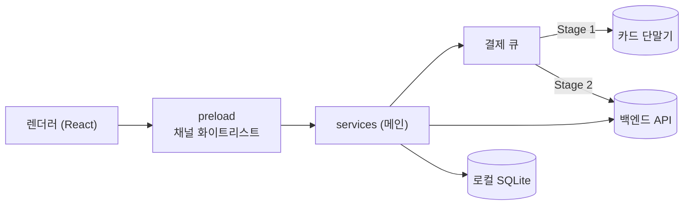

# 리테일 POS 데스크톱 클라이언트 v2

**Windows 매장 POS 앱 (Electron)** — 카드 단말기·백엔드 서버·로컬 DB 세 곳의 상태가 항상 일치해야 하고,
어느 한 곳이 끊겨도 **이중 승인·승인 누락이 생기면 안 되는** 제약 아래 설계한 실서비스 클라이언트입니다.

> 🔒 실제 운영 중인 상용 서비스이므로 **사명·서버 도메인·저장소 주소·VAN사 실명과 전문 규격·자격증명은 모두 제거**했고,
> 코드 조각은 원본 발췌가 아닌 구조 재작성입니다. 비공개 처리 내역은 [DESIGN.md §1](DESIGN.md#1-문서-범위와-공개-처리)에 항목별로 정리했습니다.

<br>

## 한눈에 보기

| | |
|---|---|
| **형태** | Windows 데스크톱 애플리케이션 (NSIS 설치본, 서버 기반 자동 업데이트) |
| **클라이언트 스택** | Electron 29 · React 18 · Vite 5 · Zustand · better-sqlite3 |
| **백엔드** | PHP REST API + MySQL *(별도 저장소 · 본 문서 범위 외)* |
| **코드 규모** | 약 **25,700 LOC** — 메인 프로세스 7.1k / 렌더러 18.3k |
| **구성 요소** | IPC 채널 57개 · 모달 25개 · VAN 프로바이더 4종 · 마이그레이션 10개 |
| **기록 구간** | 2026.06 ~ 2026.08 · 커밋 73건 · 릴리스 태그 v1.7.5 → **v2.1.2** |
| **담당** | 클라이언트 주개발 (커밋 73건 중 53건, 2인 협업) — 아키텍처 설계, 결제/VAN 파이프라인, 로컬 DB, 배포 자동화, 렌더러 UI |

### 구현 기능 범위

```
결제         현금 · 카드 · 간편결제(QR) · 분할결제 · 부분/전체 취소 · 교환(차액 결제)
증빙         영수증 출력/재출력 · 현금영수증(발행·취소) · 전자영수증(문자 발급) · 택스리펀드(즉시/사후)
상품         바코드 스캔 · 상품 검색 · 즐겨찾기 · 이벤트/프로모션 단가 · 상품별 할인 · 추가할인
회원         회원 조회/등록/수정 · 온라인 회원 연동 · 적립금 사용 · 쿠폰 적용 · 구매이력
매장 운영     개점/폐점 · 판매 이력 조회 · 보류(홀드오프) · 판매처 선택 · 고객표시창(듀얼 모니터)
시스템        자동 로그인 · 딥링크 인증 · 자동 업데이트 · 트레이 상주 · 네트워크/단말 상태 표시 · 데모 모드
```

<br>

## 문제와 접근

POS는 일반 웹 서비스와 달리 **되돌릴 수 없는 부작용**을 다룹니다. 카드 승인은 수십 초가 걸리는 외부 단말기 통신이고,
승인은 됐는데 서버 확정이 실패하면 **고객 카드에서 돈은 빠져나갔지만 매출 기록이 없는** 상태가 됩니다.
반대로 재시도를 잘못 설계하면 **같은 카드에 두 번 승인**됩니다.

이 제약을 코드 규칙이 아니라 **구조**로 막는 것을 설계 목표로 삼았습니다.


```mermaid
flowchart LR
    UI["렌더러 (React)"] --> PL["preload<br/>채널 화이트리스트"]
    PL --> SVC["services (메인)"]
    SVC --> Q["결제 큐"]
    SVC --> API[("백엔드 API")]
    SVC --> DB[("로컬 SQLite")]
    Q -->|"Stage 1"| VAN[("카드 단말기")]
    Q -->|"Stage 2"| API
```

### 핵심 설계 판단 3가지

**1. 재시도 단위를 "결제 전체"가 아니라 "단계"로 쪼갰다**
카드 승인(Stage 1)이 성공하면 승인 결과를 큐 레코드에 먼저 기록하고, 서버 확정(Stage 2)이 실패하면 **확정만** 재시도합니다.
재시도가 카드에 두 번 닿지 않으면서 승인 기록도 유실되지 않습니다. 오류는 `retryable` 여부를 스스로 알려주게 만들어,
카드 거절처럼 재시도 가치가 없는 실패는 즉시 데드레터로 보냅니다.
→ [DESIGN.md §4.2 이중 승인을 막는 2단계 큐](DESIGN.md#42-이중-승인을-막는-2단계-큐)

**2. 카드 단말기를 8개 메서드 인터페이스 하나로 봉인했다**
VAN사마다 통신 방식이 전혀 다르지만, 서비스·큐·영수증 코드는 **어느 VAN사인지 모릅니다**. 매장 설정값 하나로 주입됩니다.
덕분에 신규 VAN사 추가가 파일 1개로 끝났고, "단말기 없는 무인 매장" 요구는 모든 동작이 no-op인 **가상 단말 프로바이더**가 그대로 흡수했습니다.
→ [DESIGN.md §5 VAN 추상화](DESIGN.md#5-van-추상화)

**3. 규칙을 문서가 아니라 런타임에서 막았다**
렌더러는 `ipcRenderer`에 접근할 수 없고, preload의 화이트리스트를 통과한 57개 채널만 메인으로 넘어갑니다.
채널 등록을 빠뜨리면 즉시 에러가 나므로 규칙이 강제됩니다. 같은 발상으로 **기본 환경은 항상 운영 서버**(개발 서버 선택은 별도 표식이 있는 PC에서만 노출),
**자동 업데이트는 서버 버전이 더 높을 때만** 실행해 롤백 시 전 매장이 구버전으로 되돌아가는 사고를 구조적으로 차단했습니다.
→ [DESIGN.md §3.2 보안 경계](DESIGN.md#32-보안-경계--preload-화이트리스트) · [§8 운영 안전장치](DESIGN.md#8-운영-안전장치)

<br>

## 더 읽을 거리 — [DESIGN.md](DESIGN.md)

구조와 판단 근거를 12개 절로 정리한 설계 노트입니다.

- [§3 아키텍처](DESIGN.md#3-아키텍처) — 계층별 책임, 요청 경로, 보안 경계
- [§4 결제 파이프라인](DESIGN.md#4-결제-파이프라인) — 2단계 큐, 재시도 정책, 분할·취소·교환·택스리펀드 파생 케이스
- [§6 영수증 파이프라인](DESIGN.md#6-영수증-파이프라인) — 전자영수증을 기존 출력 경로를 깨지 않고 끼워 넣은 방법
- [§9 빌드와 배포 자동화](DESIGN.md#9-빌드와-배포-자동화) — 태그 기반 CI, 버전 일치 검증, 자동 업데이트
- [§10 운영 중 개선 사례](DESIGN.md#10-운영-중-개선-사례) — 현장 피드백 3건의 증상 → 원인 → 판단
- [§12 회고](DESIGN.md#12-회고) — 잘한 판단과, 다음에 다르게 할 것

<br>

<sub>포트폴리오 제출용 문서입니다. 회사 자산에 해당하는 식별 정보·자격증명·외부 연동 규격은 의도적으로 제외했습니다.</sub>
